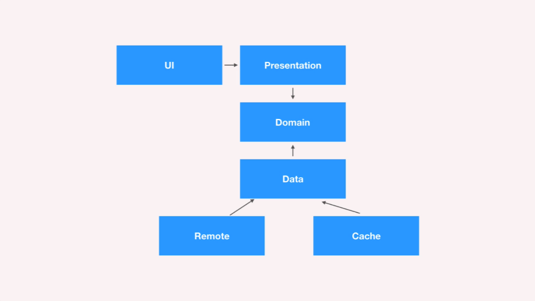

  

PayBill Manager (work-in-progress 👷🔧️👷‍♀️⛏)
-------------------
Paybill manger is an Android app meant to help you manage your bill using [Daraja API](https://developer.safaricom.co.ke/docs)

It attempts to use the latest cutting edge libraries and tools. As a summary:

 * Entirely written in [Kotlin](https://kotlinlang.org/)
 * Uses [RxJava](https://github.com/ReactiveX/RxJava) 2
 * Uses [Android Jetpack](https://developer.android.com/jetpack/)
 * Uses [Navigation Architecture Components](https://developer.android.com/topic/libraries/architecture/navigation/)
 * Uses all of the [Architecture Components](https://developer.android.com/topic/libraries/architecture/): Room, LiveData and Lifecycle-components
 * Uses [dagger-android](https://google.github.io/dagger/android.html) for dependency injection
 * Implements [clean architecture](https://github.com/android10/Android-CleanArchitecture)
 * Uses [Material Design Tools](https://material.io/tools/) and [Material Design components](https://material.io/develop/android/)
  
 
 
# Development Environment

The app is written entirely in Kotlin and uses the Gradle build system. You require [Android Studio 3.2 Canary 14 or higher](https://developer.android.com/studio/preview/). This is because lower versions don't support Navigation Components yet.

## API Keys
For the app to make requests you require a [Safaricom Dev Account](https://developer.safaricom.co.ke/ ). Once you have one, go ahead and [create an application](https://developer.safaricom.co.ke/user/1079/apps/add) in order to get your credentials

Once you have it, open `gradle.properties` file and paste your API key in `SAFARICOM_CONSUMER_KEY` and `SAFARICOM_CONSUMER_SECRET` variables respectively.

# Architecture

We followed the recommendations laid out in the [Guide to App Architecture](https://developer.android.com/jetpack/docs/guide) when deciding on the architecture for the app. We kept logic away from Activities and Fragments and moved it to [ViewModel](https://developer.android.com/topic/libraries/architecture/viewmodel).

On top of this, We use a [clean architecture](https://github.com/android10/Android-CleanArchitecture) approach to abstract functionality to respective modules. This has been explained below. 🤓

## Module Layers

As mentioned before, this project uses [clean architecture](https://github.com/android10/Android-CleanArchitecture) to abstract all functionality. We've done this by isolation functionality in respective modules.

* **UI (mobile):** This layer is responsible for the UI of the app. This layer contains Android framework application implementation. At the moment we are only supporting Phones but we may add tablet support later on and  we'll create a separate module for this. We'll implement the [Navigation Component](https://developer.android.com/topic/libraries/architecture/navigation/) that will handle app navigation.

* **Presentation:** The Presentation layer allows us to abstract the presentation logic from the framework specific implementation of our user interface. We'll be using [MVVM](https://en.wikipedia.org/wiki/Model%E2%80%93view%E2%80%93viewmodel) and [android architecture components library](https://developer.android.com/topic/libraries/architecture/) to handle presentation of our app.
 
* **Domain:** This houses business rules/use case classes. This provides the core functionality of the project, think of it as rules of the projects. eg, Add Bill, Update Bill, Make payment. e.t.c

* **Data:** The Data layer allows us to abstract the sources of the data that our application uses. It implements the domain later to help us satisfy the required functionality. It will help us determine where we should fetch data from, Cache or remote.

* **Remote:** The Remote layer allows us to abstract the sources of the remote data that our application uses. We'll use [Retrofit](https://square.github.io/retrofit/) to handle networking functionality. 

* **Cache:** The Cache layer allows us to abstract the local source of data that our application uses. We'll use [Room](https://developer.android.com/topic/libraries/architecture/room) to handle local storage.

## Libraries Used
* [Foundation][0] - Components for core system capabilities, Kotlin extensions and support for
  multidex and automated testing.
  * [AppCompat][1] - Degrade gracefully on older versions of Android.
  * [Android KTX][2] - Write more concise, idiomatic Kotlin code.
  * [Test][3] - An Android testing framework for unit and runtime UI tests.
  * [Robolectic][16] - For UI test
  
* [Architecture][4] - A collection of libraries that help you design robust, testable, and
  maintainable apps. Start with classes for managing your UI component lifecycle and handling data
  persistence.
  * [Lifecycles][5] - Create a UI that automatically responds to lifecycle events.
  * [LiveData][6] - Build data objects that notify views when the underlying database changes.
  * [Navigation][7] - Handle everything needed for in-app navigation.
  * [Room][8] - Access your app's SQLite database with in-app objects and compile-time checks.
  * [ViewModel][9] - Store UI-related data that isn't destroyed on app rotations. Easily schedule
     asynchronous tasks for optimal execution.
     
* Third party
  * [Retrofit][10] - for network calls
  * [Dagger][11] - for injection
  * [Timber][12] - for logging  
  * [Okhttp][13] - for networking with Retrofit
  * [Okhttp Logging Interceptor][14] - for logging network traffic
  * [RxAndroid][15] for writing reactive componects
  
[0]: https://developer.android.com/jetpack/foundation/
[1]: https://developer.android.com/topic/libraries/support-library/packages#v7-appcompat
[2]: https://developer.android.com/kotlin/ktx
[3]: https://developer.android.com/training/testing/
[4]: https://developer.android.com/jetpack/arch/
[5]: https://developer.android.com/topic/libraries/architecture/lifecycle
[6]: https://developer.android.com/topic/libraries/architecture/livedata
[7]: https://developer.android.com/topic/libraries/architecture/navigation/
[8]: https://developer.android.com/topic/libraries/architecture/room
[9]: https://developer.android.com/topic/libraries/architecture/viewmodel
[10]: https://square.github.io/retrofit/
[11]: https://github.com/google/dagger
[12]: https://github.com/JakeWharton/timber
[13]: https://square.github.io/okhttp/
[14]: https://github.com/square/okhttp/tree/master/okhttp-logging-interceptor
[15]: https://github.com/ReactiveX/RxAndroid
[16]: http://robolectric.org/

## RoadMap
- [x] Setup Travis CI
- [x] Add Kotlin Support
- [x] Create payment module
- [x] Add CodeCov
- [x] Setup CodeQuality Checks
- [ ] Setup Crashlytics
- [ ] Use WorkManager for reminders
- [ ] Get CodeCoverage above 70%
- [ ] Setup LeakCanary
- [ ] Release Beta Version

## Contributions

If you've found an error in this sample, please file an issue.

Patches are encouraged, and may be submitted by forking this project and submitting a pull request. Since this project is still in its very early stages, if your change is substantial, please raise an issue first to discuss it.

#### Would you like to contribute code?

1. [Fork Paybill Manager](https://github.com/kioko/paybill-manager).
2. Create a new branch ([using GitHub](https://help.github.com/articles/creating-and-deleting-branches-within-your-repository/)) or the command `git checkout -b branch-name dev`).
3. [Start a pull request](https://github.com/kioko/paybill-manager/compare). Reference [existing issues](https://github.com/kioko/paybill-manager/issues) when possible.

#### No code!
* You can [discuss a bug](https://github.com/kioko/paybill-manager/issues) or if it was not reported yet [submit a bug](https://github.com/kioko/paybill-manager/issues/new).

License
-------

    Copyright 2018 Thomas Kioko

    Licensed under the Apache License, Version 2.0 (the "License");
    you may not use this file except in compliance with the License.
    You may obtain a copy of the License at

       http://www.apache.org/licenses/LICENSE-2.0

    Unless required by applicable law or agreed to in writing, software
    distributed under the License is distributed on an "AS IS" BASIS,
    WITHOUT WARRANTIES OR CONDITIONS OF ANY KIND, either express or implied.
    See the License for the specific language governing permissions and
    limitations under the License.

